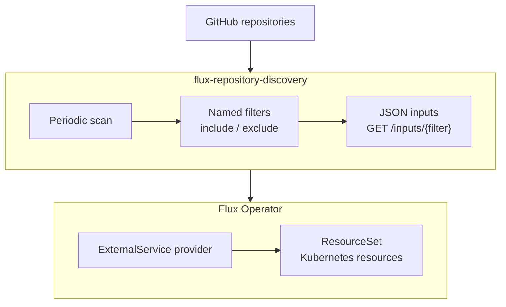

# flux-repository-discovery

An HTTP service written in Go that discovers github.com repositories, applies named filters, and serves JSON for Flux Operator ExternalService. Supports organizations, personal accounts, private repositories, PATs, and GitHub Apps.

A source failure returns HTTP 503. A successful scan with no matches returns `{"inputs":[]}`. Partial catalogs and stale results are never served after a failed scan.

## How it works



The service periodically scans the configured GitHub sources, applies each named filter, and serves the matching repositories as `{"inputs":[...]}`. Flux Operator polls the filter's HTTP endpoint through a `ResourceSetInputProvider` of type `ExternalService`. A `ResourceSet` uses these inputs to create Kubernetes resources, such as the `GitRepository` resources in the [Flux example](examples/flux.yaml).

## Getting started

Run the prebuilt image `ghcr.io/vterdunov/flux-repository-discovery:latest` with Docker. See [Container image and CI](#container-image-and-ci) for available tags and platforms. For private GHCR packages, [authenticate to the registry](https://docs.github.com/en/packages/working-with-a-github-packages-registry/working-with-the-container-registry#authenticating-to-the-container-registry) before pulling the image.

Create `config.yaml` and `credentials.yaml` in your current directory using the [minimal PAT configuration below](#configuration). Replace `acme` with your GitHub owner and export `FRD_COMPANY_GITHUB_TOKEN` with a PAT that can read the intended repositories. The following command forwards that environment variable and mounts both files read-only:

```sh
docker run --rm --name flux-repository-discovery \
  --publish 127.0.0.1:8080:8080 \
  --env FRD_COMPANY_GITHUB_TOKEN \
  --mount "type=bind,src=$PWD/config.yaml,dst=/config.yaml,readonly" \
  --mount "type=bind,src=$PWD/credentials.yaml,dst=/credentials.yaml,readonly" \
  ghcr.io/vterdunov/flux-repository-discovery:latest serve \
  --config /config.yaml \
  --credentials-file /credentials.yaml
```

Mounted files must be readable by the image's user (`65532:65532`). For GitHub Apps or file-based tokens, use the full [configuration](examples/config.yaml) and [credentials](examples/credentials.yaml) examples and mount secret files at the paths referenced inside the container. See the [Docker run reference](https://docs.docker.com/reference/cli/docker/container/run/) for mount and environment options.

Once the first scan completes, query the selected repositories from another terminal:

```sh
curl --fail-with-body http://localhost:8080/inputs/applications
```

To connect Flux Operator, deploy the image as an HTTP service reachable from the cluster and point the provider in the [Flux example](examples/flux.yaml) at its `/inputs/applications` endpoint.

The first scan starts immediately. Each subsequent scan starts `scan.interval` after the previous scan finishes. The default interval is 10 minutes, with a 2-minute timeout for the entire scan. SIGINT/SIGTERM cancel scanning and shut down the HTTP server.

## Container image and CI

[CI](.github/workflows/ci.yaml) runs `mise run check`, then builds `linux/amd64` and `linux/arm64` images on PRs and pushes to `main`. The final stage is `gcr.io/distroless/static-debian13:nonroot`.

Registry: `ghcr.io/vterdunov/flux-repository-discovery`. PRs publish `pr-<number>`; `main` publishes `main` and `latest`. Both publish `sha-<full-commit>`; PR images use the tested merge commit. Fork and Dependabot PRs build without publishing.

## Configuration

A minimal PAT configuration:

```yaml
version: 1
sources:
  company:
    owners: [acme]
    credential: company-token
filters:
  applications:
    sources: [company]
    include:
      - topics:
          all: [gitops]
```

Its separate credentials file:

```yaml
credentials:
  company-token:
    token:
      valueEnv: FRD_COMPANY_GITHUB_TOKEN
```

The configuration accepts YAML or JSON. Unknown fields, duplicate keys, invalid references, and ambiguous empty conditions are rejected. Source, filter, and credential names must match `[a-z][a-z0-9-]{0,62}`.

The main file and its normalized JSON representation are each limited to 1 MiB. The `config` package checks these limits before passing prepared configuration to the service.

| Setting | Default | Environment variable |
| --- | --- | --- |
| Main configuration path | Required | `FRD_CONFIG` |
| Credentials file path for `serve` | Required | `FRD_CREDENTIALS_FILE` |
| `server.listen` | `:8080` | `FRD_LISTEN` |
| `scan.interval` | `10m` | `FRD_SCAN_INTERVAL` |
| `scan.timeout` | `2m` | `FRD_SCAN_TIMEOUT` |

Explicit CLI path flags take precedence over environment variables. Server settings use this precedence: defaults < file < environment. Sources and filters are configured only through the file. Configuration and secrets are loaded once; the platform restarts the process to apply changes.

Filter semantics:

- Source catalogs are combined and deduplicated by numeric GitHub repository ID.
- `include` rules are combined with OR. Conditions within one rule are combined with AND.
- `topics.all` requires every listed topic; `topics.any` requires at least one. Both may be used together.
- `repositories` lists exact `owner/name` values from source catalogs. It is a filter condition and makes no additional repository lookup.
- `nameRegex` matches the short repository name. Use `^...$` for a full match or `.*` to select all names.
- `exclude` takes precedence. Archived repositories and forks are always skipped, with no additional topic requests.
- Exact names and topics are compared without case sensitivity. Regular expressions are case-sensitive unless `(?i)` is specified.
- Conflicting metadata for the same ID causes dependent filters to return an error.

A GitHub App credential represents one installation. Multiple installations require separate credential names. A PAT reads the catalog accessible to its token; for a personal account, the owner's public catalog is combined with repositories accessible to the authenticated user. An App lists its installation's repositories and verifies the installation owner.

Fine-grained PATs and Apps require access to the intended repositories with `Metadata: read`. Listing repositories does not require reading their files. Visibility is limited by credential permissions: GitHub may successfully return a smaller accessible catalog after permissions change. The service cannot distinguish that response from a repository disappearing normally. [GitHub repository API](https://docs.github.com/en/rest/repos/repos#list-organization-repositories).

Discovery credentials are not passed to Flux. Configure source-controller authentication separately for cloning private repositories.

## Dry-run

Edit a local `candidate.yaml` and submit it to the container started above. The CLI container shares the service container's network so it can reach the HTTP endpoint at `localhost:8080`:

```sh
docker run --rm \
  --network container:flux-repository-discovery \
  --mount "type=bind,src=$PWD/candidate.yaml,dst=/candidate.yaml,readonly" \
  ghcr.io/vterdunov/flux-repository-discovery:latest dry-run \
  --config /candidate.yaml \
  --against http://localhost:8080
```

Add `--output json --detailed-exitcode` to get a JSON report and exit code 3 when changes are found. For a service deployed elsewhere, set `--against` to its reachable URL and adjust the container network accordingly.

The CLI makes no GitHub requests and loads no credentials. Local server environment overrides are not applied to the candidate. The server uses its current credentials and environment overrides.

The report contains:

- Complete structural differences between declared and effective configurations: `configChanges`, `effectiveChanges`, and `overrides`.
- Per-filter `added`, `removed`, `changed`, and `unchanged` results, before/after counts, complete proposed `inputs`, and `unmatchedRepositories`.
- Separate `drift` between published inputs and fresh data evaluated with the current rules.
- Configuration revisions, the base generation, and the observation time.

Current and proposed rules are evaluated against the same fresh catalog. Every change is shown without truncation. Removing a filter reports that its endpoint will return HTTP 404. If there is no successful baseline generation, drift comparison is marked unavailable.

The preview activates nothing and leaves background scan state unchanged. After reviewing it, replace the active configuration separately and let the platform restart the service. New credential names must first be loaded by the running server. Dry-run does not verify future secrets or environment settings.

| Exit code | Meaning |
| --- | --- |
| 0 | Success |
| 1 | Execution or service error |
| 2 | Invalid local arguments or configuration |
| 3 | Success with changes, only with `--detailed-exitcode` |

Errors are written to stderr. `--output json` writes only JSON to stdout. V1 allows one concurrent dry-run, bounded by the current server scan timeout. The CLI limits the request to five minutes and the report to 32 MiB.

## HTTP and Flux

| Endpoint | Contract |
| --- | --- |
| `GET /inputs/{filter}` | `{"inputs":[{"id":"123","fullName":"acme/api","owner":"acme","name":"api"}]}` |
| `POST /api/v1/dry-run` | Request body `{"config":{...}}`, version 1 report |
| `GET /api/v1/status` | Revision, generation, timestamps, source and filter states |
| `GET /healthz` | HTTP process is alive |
| `GET /readyz` | Scan loop has started; individual GitHub source failures do not affect readiness |

Inputs are sorted by numeric ID, which remains stable across renames. The limits are 900 KiB and 10000 inputs; exceeding either returns 503 without truncation. Inputs also return 503 before the first scan or after a required source fails. Successful results from independent sources remain available. A generation becomes unavailable when its age exceeds `interval + timeout`. Responses include `Cache-Control: no-store`.

Errors use the form `{"error":{"code":"source_unavailable","message":"...","sources":["company"]}}`, with no `inputs`. An unknown filter returns 404; an invalid dry-run request returns 400, invalid configuration 422, a body larger than 1 MiB 413, an already busy dry-run 429, and a source failure 503.

`encoding/json/v2` decodes requests: malformed JSON, duplicate fields at any depth, and unknown envelope fields return 400. The `config` package checks configuration rules; failures such as unknown sources or credentials and invalid regular expressions return 422.

The server writes JSON logs to stderr with the generation, source/filter, repository count, error code, and GitHub request ID. A source event's `duration` measures the entire scan attempt. Secrets and arbitrary transport error text are excluded from logs.

The [Flux example](examples/flux.yaml) contains an ExternalService provider and a ResourceSet that creates GitRepository resources named from `inputs.id`. The provider explicitly sets `filter.limit: 10000` so Flux's default limit of 100 does not truncate the selection. Repository URLs use `inputs.fullName`. [ExternalService contract](https://fluxoperator.dev/docs/crd/resourcesetinputprovider/#type).

The example explicitly selects the `main` branch; adjust the template for your repositories. V1 inputs do not include the branch. Without `spec.ref`, Flux uses `master`. [GitRepository reference](https://fluxcd.io/flux/components/source/gitrepositories/#reference).

The v1 HTTP API has no authentication. Separate middleware hooks are available for inputs and operator operations. Future CLI login through Google Workspace/OIDC is tracked in [docs/TODO.md](docs/TODO.md).

## Development and verification

Install [mise](https://mise.jdx.dev/) to build from source. Development tool versions are pinned in [mise.toml](mise.toml).

```sh
mise install
mise run build
bin/flux-repository-discovery version
bin/flux-repository-discovery validate --config examples/config.yaml
```

To run the local binary with your configuration and credentials:

```sh
bin/flux-repository-discovery serve \
  --config config.yaml \
  --credentials-file credentials.yaml
```

The only external runtime dependency is `go.yaml.in/yaml/v3`. Routing, CLI, HTTP, JSON, regular expressions, cryptography, and test tooling use the standard library.

The service and CLI use `encoding/json/v2` and `encoding/json/jsontext`. Response formats, complete diff values, and configuration revisions remain stable. JSON decoding rejects duplicate fields and invalid UTF-8; see the [migration and verification record](docs/jsonv2-migration.md).

The `config` package converts an input `Document` into an immutable `Config` with prepared filters. `Decode` reads file contents and applies defaults; `Parse` accepts a fully populated Go document. `Prepare` binds configuration to server environment settings and credential names, returning a `Runtime` for `service.New`. Dry-run uses the same captured server context. Accessors return copies of mutable collections. Regular expressions are compiled during parsing and reused during filtering. Zero `Config`, `Runtime`, and `Filter` values are rejected at preparation and execution boundaries. See the [refactor verification record](docs/verification.md#prepared-configuration-refactor).

```sh
mise run check
# Run only the real binary, HTTP, CLI, and SIGTERM test:
mise run test-cli
# Optional integration with a real, isolated Flux Operator:
mise exec -- bash integration/flux/run.sh
```

`check` runs unit tests, the race detector, golangci-lint, actionlint, a build, and the [Go binary test](integration/cli/cli_test.go). The binary test supports Linux/macOS and requires localhost access. It builds current sources into a temporary directory, starts the service without GitHub sources, and checks HTTP, the actual CLI dry-run, and SIGTERM shutdown. Temporary files and child processes are cleaned up on both success and failure. This check requires no Python. See its [contract and verification results](docs/tdd-cli-binary.md).

API tests were written by an independent agent before implementation. RED evidence and SHA256 hashes are recorded in `docs/tdd-*.md`. Additional regressions found during independent review were recorded separately before fixes.

GitHub tests use a fake HTTP transport without real secrets. The component integration connects the actual CLI, HTTP handlers, service, and GitHub client. A separate Flux check runs an isolated Kubernetes envtest environment and real upstream reconcilers; see [compatibility evidence and boundaries](docs/flux-compatibility.md).

Completed implementation checks are recorded in [docs/verification.md](docs/verification.md). Deferred work is tracked in [docs/TODO.md](docs/TODO.md).
