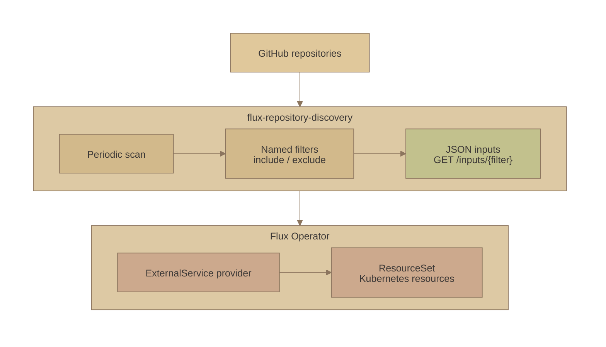

# Gruvbox Sand styling comparison

The original palette 7 followed by three CSS treatments of the same diagram. Colors, content, and layout are shared so the differences in depth and corners are easy to compare.

### 7. [Gruvbox Sand](https://github.com/morhetz/gruvbox)

Original: deeper sand, faded olive, and soft terracotta.

### 7A. Soft shadows

Visible warm shadows and gently rounded nodes.

### 7B. Raised cards

Raised nodes with a firm contact shadow and a broader shadow under each group.

### 7C. Soft surfaces

Rounder corners and borderless surfaces defined by broad, layered shadows.

[Back to the project overview](../README.md#how-it-works).
