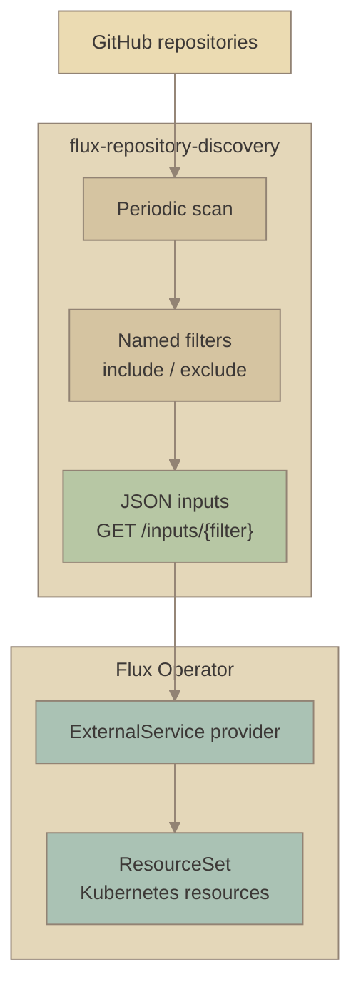
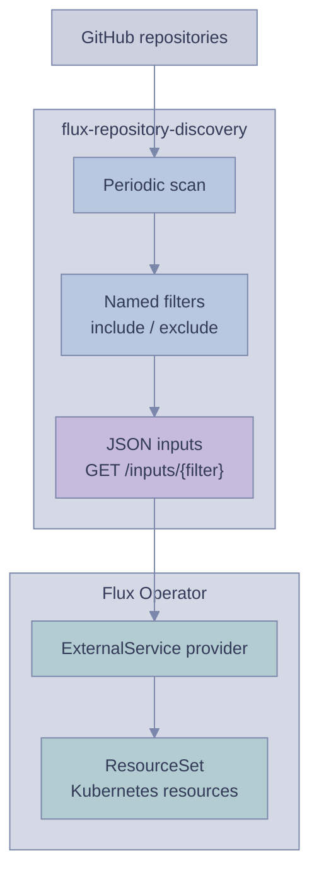
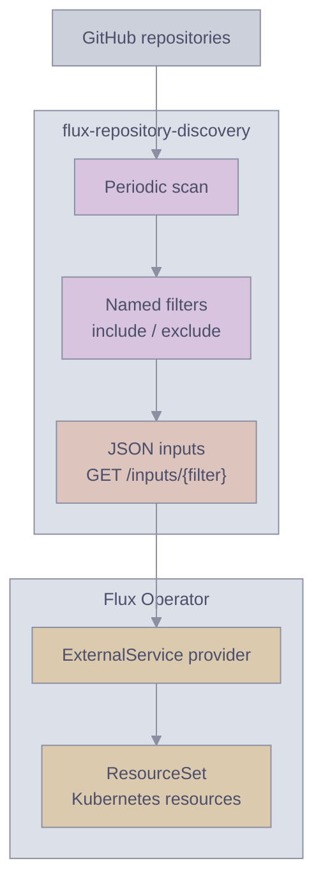
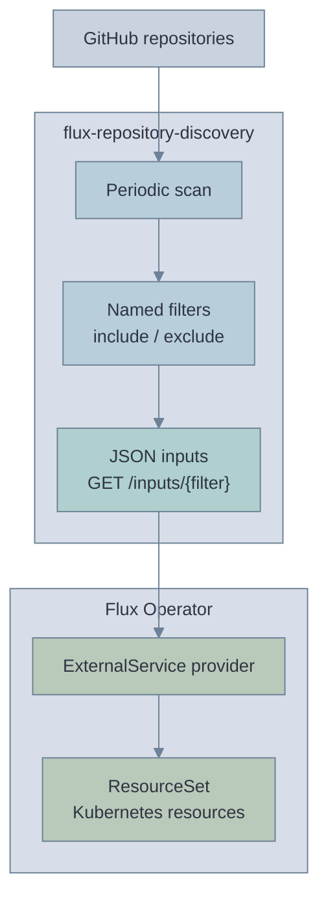
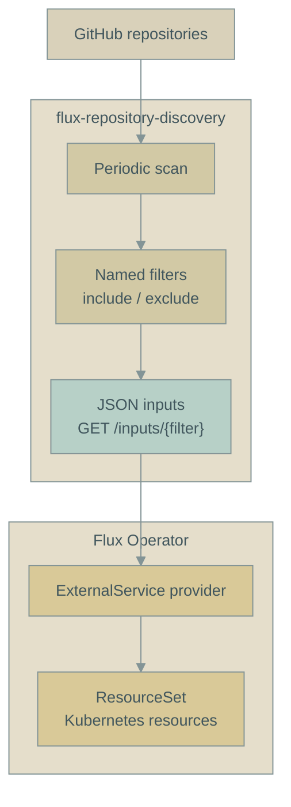
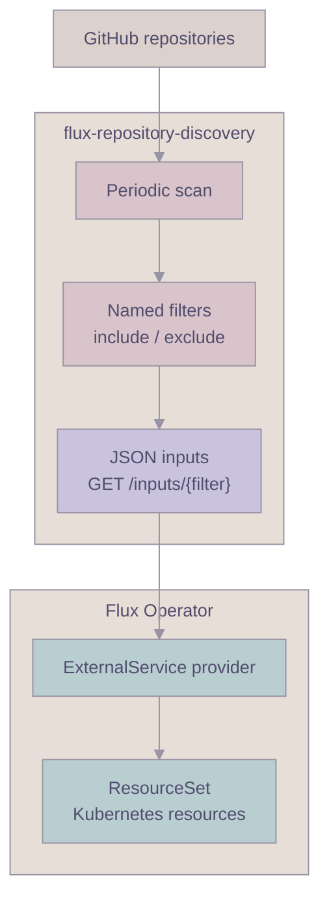

# Mermaid palette comparison

Six pastel adaptations of familiar editor palettes, shown side by side. Each diagram uses the same discovery flow and layout; only the colors change. These are custom Mermaid palettes inspired by the linked themes.

<table width="100%">
<tr>
<td width="50%" valign="top">

### 1. [Gruvbox Soft](https://github.com/morhetz/gruvbox)

Warm sand, sage, and muted aqua.

</td>
<td width="50%" valign="top">

### 2. [Tokyo Night](https://github.com/folke/tokyonight.nvim)

Cool blue, lavender, and mist.

</td>
</tr>
<tr>
<td width="50%" valign="top">

### 3. [Catppuccin Latte](https://catppuccin.com/palette/)

Muted lilac, rosewater, and peach.

</td>
<td width="50%" valign="top">

### 4. [Nord](https://www.nordtheme.com/docs/colors-and-palettes/)

Frost blue, pale teal, and cool grey.

</td>
</tr>
<tr>
<td width="50%" valign="top">

### 5. [Solarized Light](https://ethanschoonover.com/solarized/)

Sand, faded cyan, and soft yellow.

</td>
<td width="50%" valign="top">

### 6. [Rosé Pine Dawn](https://rosepinetheme.com/palette/)

Dusty rose, muted iris, and warm grey.

</td>
</tr>
</table>

[Back to the project overview](../README.md#how-it-works).
