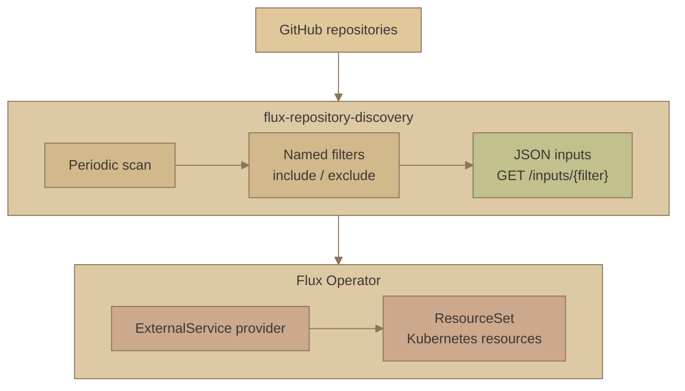

# Gruvbox Sand styling comparison

The original palette 7 followed by three CSS treatments of the same diagram. Colors, content, and layout are shared so the differences in depth and corners are easy to compare.

### 7. [Gruvbox Sand](https://github.com/morhetz/gruvbox)

Original: deeper sand, faded olive, and soft terracotta.



### 7A. Soft shadows

A small warm shadow and gently rounded nodes.

```mermaid
---
config:
  theme: base
  themeVariables:
    fontFamily: "system-ui, sans-serif"
    fontSize: "14px"
    primaryColor: "#d2b98b"
    primaryTextColor: "#3c3836"
    primaryBorderColor: "#8c755e"
    lineColor: "#8c755e"
    textColor: "#3c3836"
    clusterBkg: "#ddc9a4"
    clusterBorder: "#8c755e"
    titleColor: "#3c3836"
  flowchart:
    nodeSpacing: 16
    rankSpacing: 50
    padding: 12
    subGraphTitleMargin:
      top: 6
      bottom: 8
---
flowchart TB
    github["GitHub repositories"]

    subgraph discovery["flux-repository-discovery"]
        direction LR
        scan["Periodic scan"] --> filters["Named filters<br/>include / exclude"]
        filters --> inputs["JSON inputs<br/>GET /inputs/{filter}"]
    end

    subgraph flux["Flux Operator"]
        direction LR
        provider["ExternalService provider"] --> resources["ResourceSet<br/>Kubernetes resources"]
    end

    github --> discovery --> flux

    classDef source fill:#e0c89b,stroke:#8c755e,color:#3c3836
    classDef output fill:#c2c18d,stroke:#8c755e,color:#3c3836
    classDef consumer fill:#cca98d,stroke:#8c755e,color:#3c3836
    class github source
    class inputs output
    class provider,resources consumer

    classDef elevated rx:6px,ry:6px,filter:drop-shadow(0px 2px 3px #3c38362e)
    class github,scan,filters,inputs,provider,resources elevated
    style discovery rx:10px,ry:10px
    style flux rx:10px,ry:10px
```

### 7B. Raised cards

More depth on the nodes and a soft shadow under each group.

```mermaid
---
config:
  theme: base
  themeVariables:
    fontFamily: "system-ui, sans-serif"
    fontSize: "14px"
    primaryColor: "#d2b98b"
    primaryTextColor: "#3c3836"
    primaryBorderColor: "#8c755e"
    lineColor: "#8c755e"
    textColor: "#3c3836"
    clusterBkg: "#ddc9a4"
    clusterBorder: "#8c755e"
    titleColor: "#3c3836"
  flowchart:
    nodeSpacing: 16
    rankSpacing: 50
    padding: 12
    subGraphTitleMargin:
      top: 6
      bottom: 8
---
flowchart TB
    github["GitHub repositories"]

    subgraph discovery["flux-repository-discovery"]
        direction LR
        scan["Periodic scan"] --> filters["Named filters<br/>include / exclude"]
        filters --> inputs["JSON inputs<br/>GET /inputs/{filter}"]
    end

    subgraph flux["Flux Operator"]
        direction LR
        provider["ExternalService provider"] --> resources["ResourceSet<br/>Kubernetes resources"]
    end

    github --> discovery --> flux

    classDef source fill:#e0c89b,stroke:#8c755e,color:#3c3836
    classDef output fill:#c2c18d,stroke:#8c755e,color:#3c3836
    classDef consumer fill:#cca98d,stroke:#8c755e,color:#3c3836
    class github source
    class inputs output
    class provider,resources consumer

    classDef elevated rx:8px,ry:8px,stroke-width:1px,filter:drop-shadow(0px 4px 4px #3c383638)
    class github,scan,filters,inputs,provider,resources elevated
    style discovery rx:12px,ry:12px,filter:drop-shadow(0px 6px 8px #3c383633)
    style flux rx:12px,ry:12px,filter:drop-shadow(0px 6px 8px #3c383633)
```

### 7C. Soft surfaces

Rounder corners and borderless surfaces defined by gentle shadows.

```mermaid
---
config:
  theme: base
  themeVariables:
    fontFamily: "system-ui, sans-serif"
    fontSize: "14px"
    primaryColor: "#d2b98b"
    primaryTextColor: "#3c3836"
    primaryBorderColor: "#8c755e"
    lineColor: "#8c755e"
    textColor: "#3c3836"
    clusterBkg: "#ddc9a4"
    clusterBorder: "#8c755e"
    titleColor: "#3c3836"
  flowchart:
    nodeSpacing: 16
    rankSpacing: 50
    padding: 12
    subGraphTitleMargin:
      top: 6
      bottom: 8
---
flowchart TB
    github["GitHub repositories"]

    subgraph discovery["flux-repository-discovery"]
        direction LR
        scan["Periodic scan"] --> filters["Named filters<br/>include / exclude"]
        filters --> inputs["JSON inputs<br/>GET /inputs/{filter}"]
    end

    subgraph flux["Flux Operator"]
        direction LR
        provider["ExternalService provider"] --> resources["ResourceSet<br/>Kubernetes resources"]
    end

    github --> discovery --> flux

    classDef source fill:#e0c89b,stroke:#8c755e,color:#3c3836
    classDef output fill:#c2c18d,stroke:#8c755e,color:#3c3836
    classDef consumer fill:#cca98d,stroke:#8c755e,color:#3c3836
    class github source
    class inputs output
    class provider,resources consumer

    classDef elevated rx:14px,ry:14px,stroke-width:0px,filter:drop-shadow(0px 3px 5px #3c383633)
    class github,scan,filters,inputs,provider,resources elevated
    style discovery rx:18px,ry:18px,stroke-width:0px,filter:drop-shadow(0px 7px 10px #3c38362e)
    style flux rx:18px,ry:18px,stroke-width:0px,filter:drop-shadow(0px 7px 10px #3c38362e)
```

[Back to the project overview](../README.md#how-it-works).
