# Mermaid palette comparison

Twelve pastel adaptations of familiar editor palettes, each shown at full width. Each diagram uses the same discovery flow and layout; only the colors change. These are custom Mermaid palettes inspired by the linked themes.

### 1. [Gruvbox Soft](https://github.com/morhetz/gruvbox)

Warm sand, sage, and muted aqua.

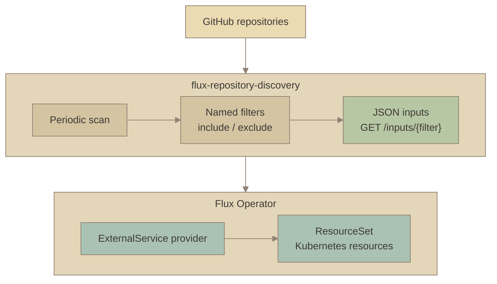

### 2. [Tokyo Night](https://github.com/folke/tokyonight.nvim)

Cool blue, lavender, and mist.

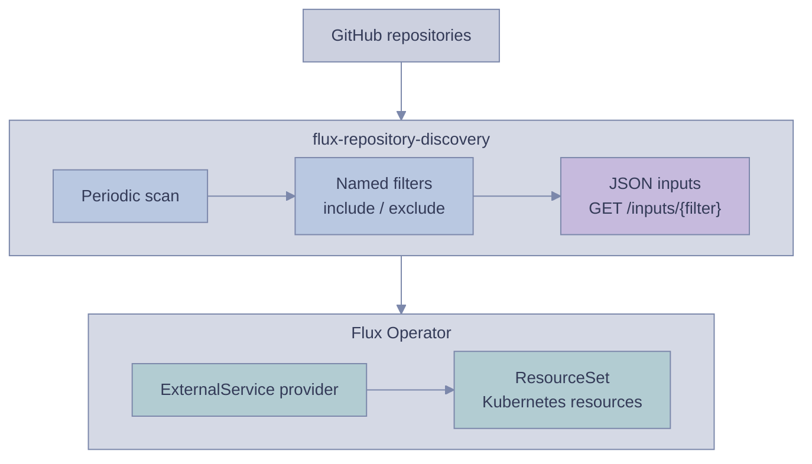

### 3. [Catppuccin Latte](https://catppuccin.com/palette/)

Muted lilac, rosewater, and peach.

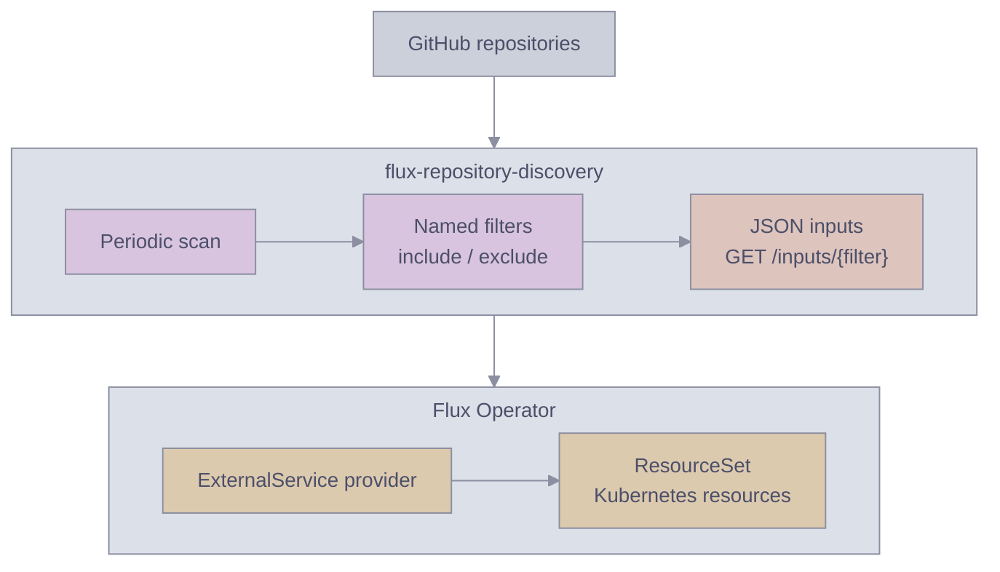

### 4. [Nord](https://www.nordtheme.com/docs/colors-and-palettes/)

Frost blue, pale teal, and cool grey.

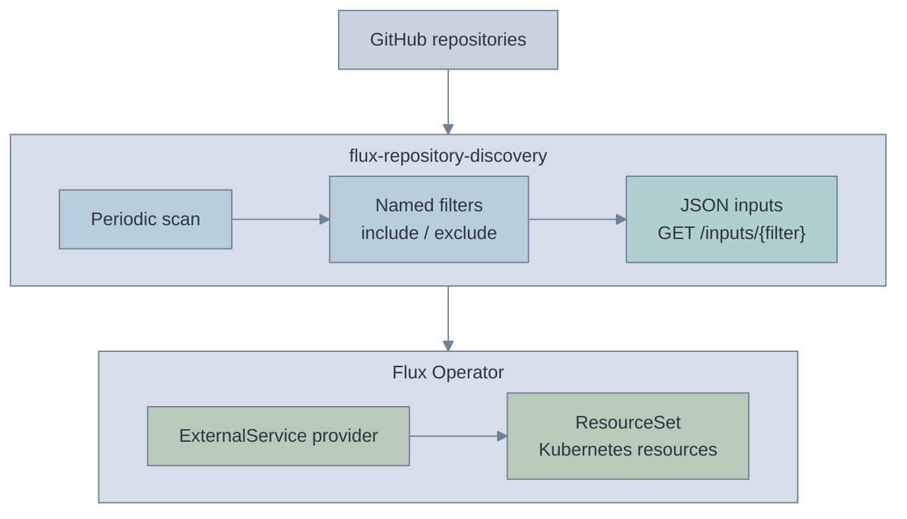

### 5. [Solarized Light](https://ethanschoonover.com/solarized/)

Sand, faded cyan, and soft yellow.

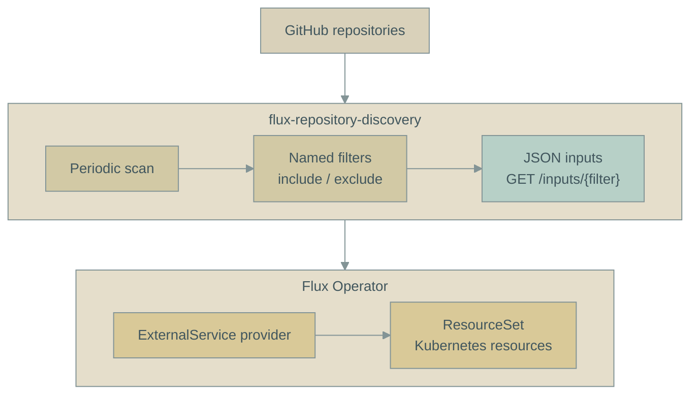

### 6. [Rosé Pine Dawn](https://rosepinetheme.com/palette/)

Dusty rose, muted iris, and warm grey.

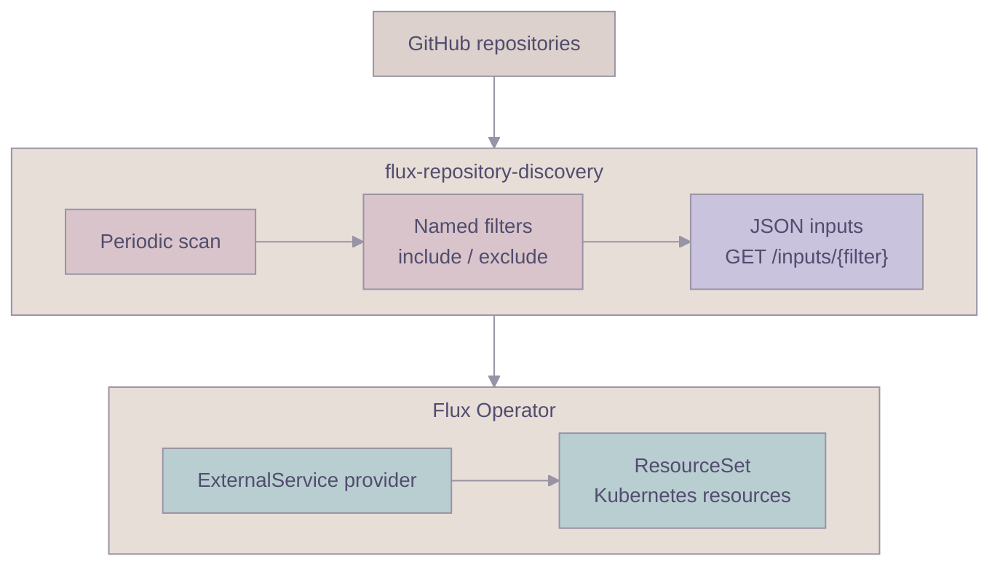

## More Gruvbox and Monokai variants

These variant names describe custom pastel adaptations. Compare them with the original six above.

### 7. [Gruvbox Sand](https://github.com/morhetz/gruvbox)

Deeper sand, faded olive, and soft terracotta.

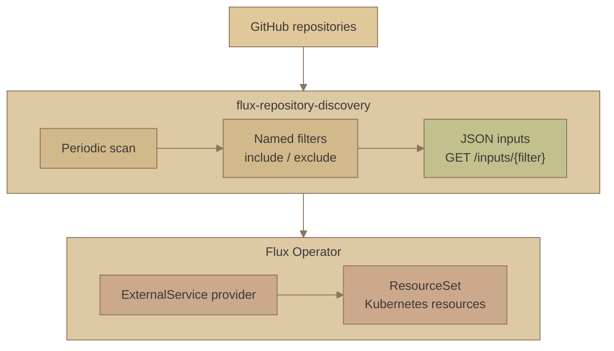

### 8. [Monokai Soft](https://monokai.pro/contribute)

Muted lime, cyan, and pink on warm grey.

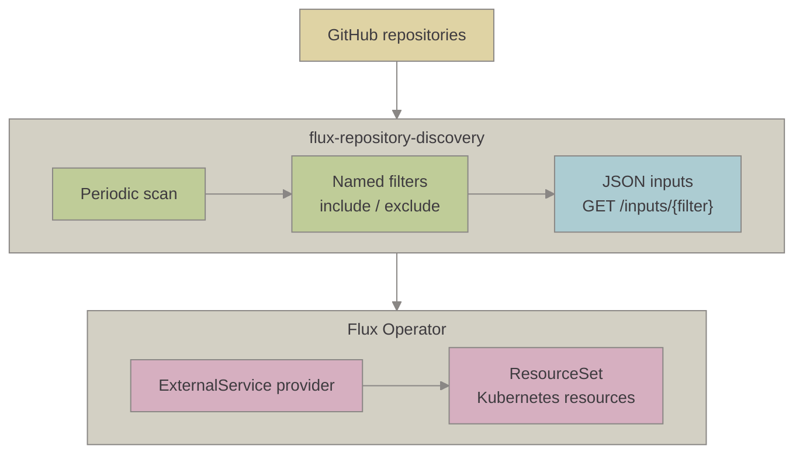

### 9. [Gruvbox Sage](https://github.com/morhetz/gruvbox)

Sage, moss, and dusty aqua.

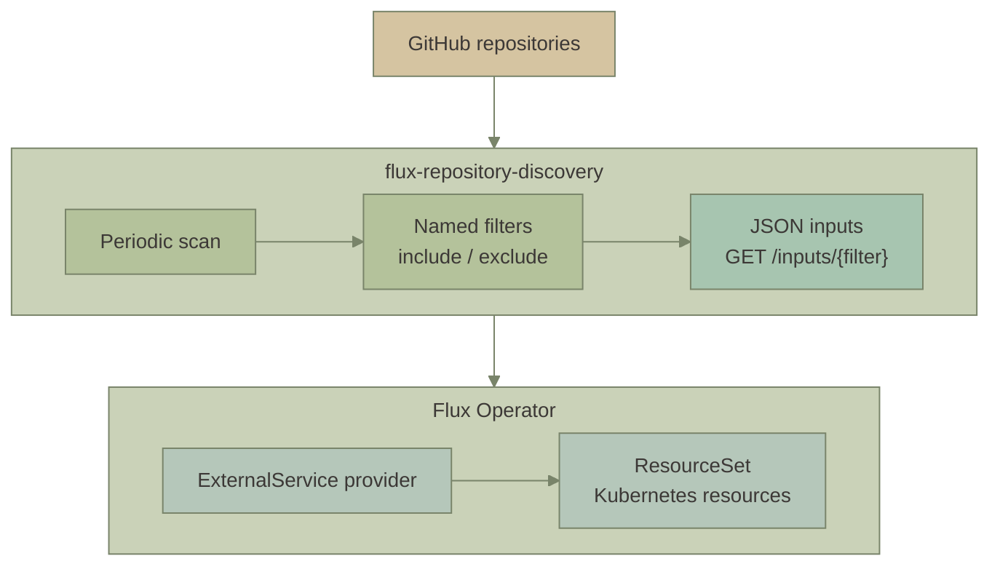

### 10. [Monokai Aqua](https://monokai.pro/contribute)

Dusty cyan, faded lime, and lilac.

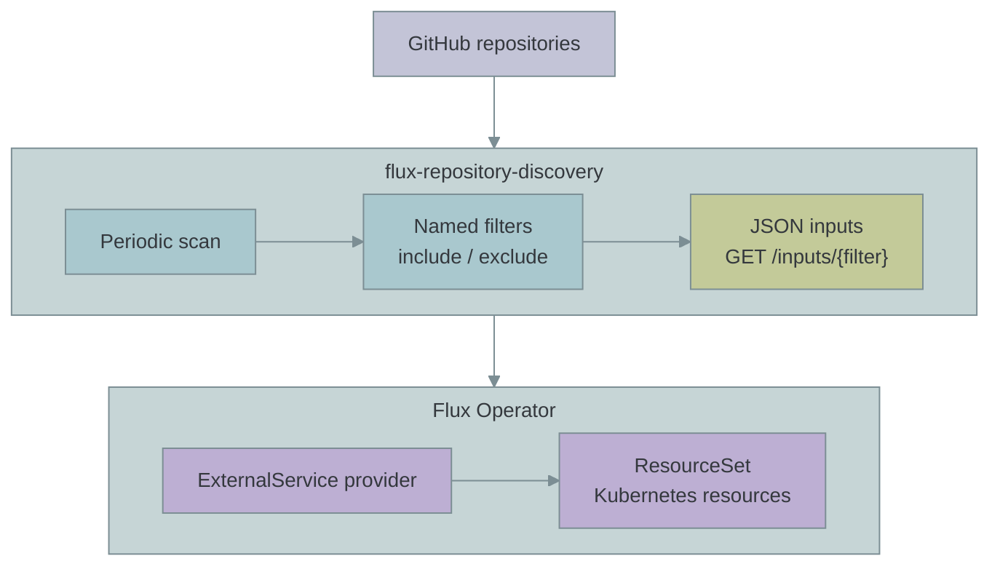

### 11. [Gruvbox Clay](https://github.com/morhetz/gruvbox)

Clay, muted plum, and olive.

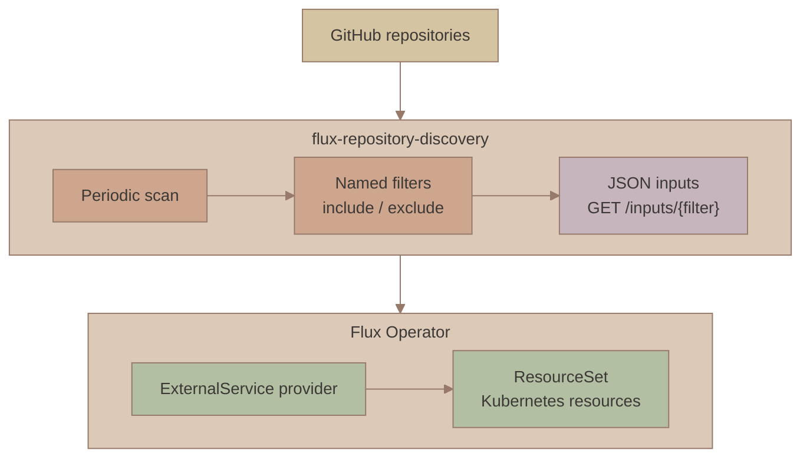

### 12. [Monokai Rose](https://monokai.pro/contribute)

Dusty pink, apricot, and soft violet.

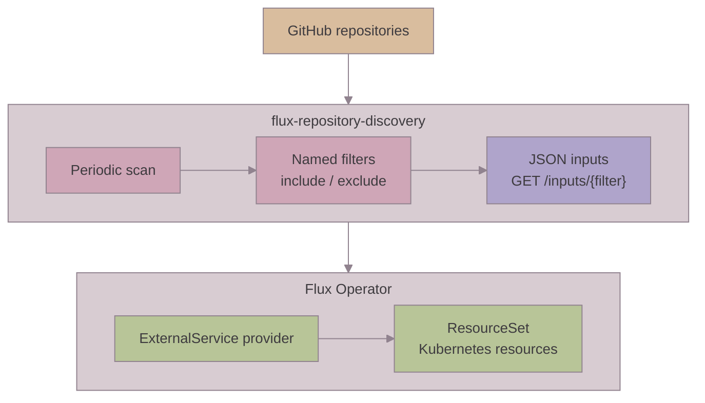

[Back to the project overview](../README.md#how-it-works).
